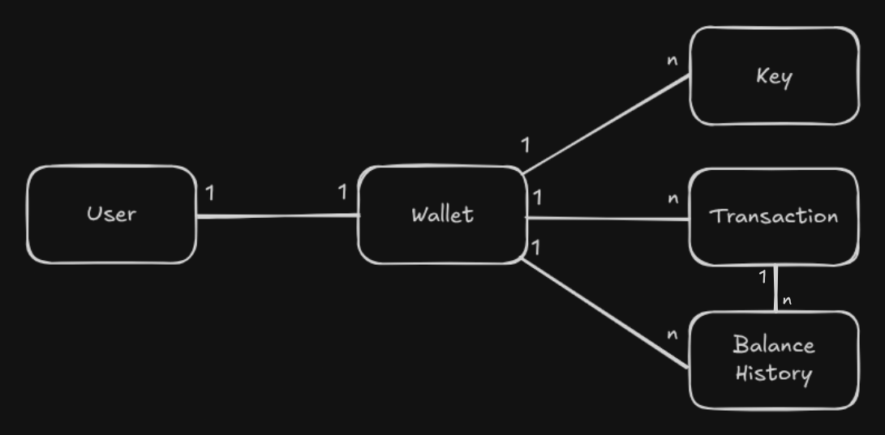

# Wallet API

Finaya Digital Wallet.

<hr/>

| Technology | Version |
|   :---:    |  :---:  |
| Java       | 21      |
| Spring     | 3.5.9   |
| PostgreSQL | 15      |
| Docker     | >29     |

## Project Structure
```
src/
└─ main/
   └─ java/
      └─ tech.finaya.wallet/
         ├─ adapter/
         │   ├─ inbounds/
         │   │   ├─ controllers/               # Controllers
         │   │   ├─ dto/
         │   │   │   ├─ requests/              # Request DTOs
         │   │   │   └─ responses/             # Response DTOs
         │   └─ outbounds/
         │       ├─ persistence/
         │       │   ├─ adapters/               # Persistence adapters
         │       │   ├─ jpa/                    # JPA/Hibernate implementations
         │       │   └─ repositories/           # Repository interfaces (Ports)
         ├─ config/                               # Spring configuration
         ├─ domain/
         │   ├─ models/                           # Domain entities (User, Order, …)
         │   ├─ models/
         │   │   └─ enums/                        # Enums used in the domain
         │   └─ models/
         │       └─ factories/                    # Domain object factories
         └─ infrastructure/
             └─ mappers/                         # Mapping classes (DTO ↔ Entity)
```
## MER



## How to run locally?

*Linux and MAC:*
1. Open a terminal in the application's root directory and run: `make up`.
2. Open your browser and go to the address http://localhost:8080/.

* Use `make down` to stop all services.

*Windows:*
1. Open a terminal in the application's root directory and run: `docker compose up -d`.
2. Open your browser and go to the address http://localhost:8080/.

* Use `docker compose down` to stop all services.

## How to run unit tests?

*Linux and MAC:*
1. Open a terminal in the application's root directory and run: `make test`.

*Windows:*
1. Open a terminal in the application's root directory and run: `./gradlew test`.

## How to run integration tests?

*Linux and MAC:*
1. Open a terminal in the application's root directory and run: `make integration-test`.

*Windows:*
1. Open a terminal in the application's root directory and run: `./gradlew integrationTest`.

## Links

[Health](http://localhost:8080/actuator/health)

[Info](http://localhost:8080/actuator/info)

[Swagger](http://localhost:8080/swagger-ui.html)

[TODO](./docs/TODO.md)